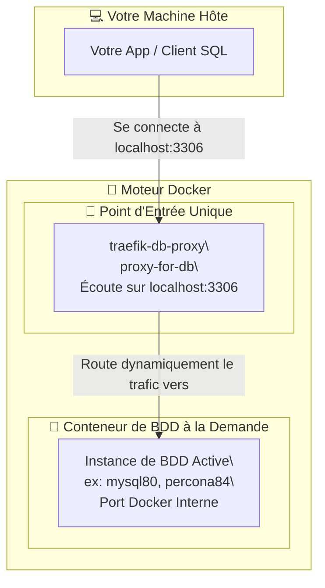

# 🚀 Gestionnaire de BDD Multi-Versions avec Docker & Traefik(multi-db-docker-env)

Ce projet fournit un environnement de développement flexible pour lancer et gérer rapidement différentes versions de **MySQL**, **MariaDB**, et **Percona Server**. Il utilise Docker, Docker Compose, et un Makefile pour simplifier les opérations.

Une fonctionnalité clé est le **reverse proxy Traefik**, qui assure que toutes les instances sont accessibles via un port unique et stable (localhost:3306), quelle que soit la version de base de données active.

## **📖 Table des Matières**

* [📋 Prérequis](#bookmark=id.zhet0fejub03)  
* [⚙️ Configuration Initiale](#bookmark=id.b9cr5t4rmmhv)  
* [✨ Utilisation avec le Makefile](#bookmark=id.52xl7xg3rjnh)  
  * [Commandes Générales](#bookmark=id.9jsqvztd4p5d)  
  * [Démarrage d'une Instance](#bookmark=id.5wrtn8p3xnm)  
* [🏛️ Architecture](#bookmark=id.9kf7euwlqyob)  
* [📁 Structure du Projet](#bookmark=id.eajaatmiia0v)  
* [💡 Workflow Typique](#bookmark=id.p5xz4f5ga536)

## **📋 Prérequis**

Avant de commencer, assurez-vous d'avoir les outils suivants installés :

* [Docker](https://docs.docker.com/get-docker/)  
* [Docker Compose](https://docs.docker.com/compose/install/) (généralement inclus avec Docker Desktop)  
* make (natif sur Linux/macOS. Pour Windows, choco install make)

## **⚙️ Configuration Initiale**

La seule étape de configuration requise est de définir le mot de passe root.

1. Créez un fichier .env à la racine du projet.  
2. Ajoutez la ligne suivante en remplaçant votre\_mot\_de\_passe\_super\_secret par un mot de passe robuste (sans guillemets).  
   \# Fichier: .env  
   DB\_ROOT\_PASSWORD=votre\_mot\_de\_passe\_super\_secret

⚠️ **Important** : Ce mot de passe est crucial pour que les commandes make mycnf et make client fonctionnent.

## **✨ Utilisation avec le Makefile**

Le Makefile est le point d'entrée pour toutes les opérations.

### **Commandes Générales**

| Commande | Icône | Description |
| :---- | :---- | :---- |
| make help | 📜 | Affiche la liste complète des commandes. |
| make stop | 🛑 | Arrête et supprime tous les conteneurs et réseaux. |
| make status | 📊 | Affiche le statut des conteneurs actifs (Traefik \+ BDD). |
| make info | ℹ️ | Fournit des infos sur le service de BDD actif. |
| make logs | 📄 | Affiche les logs du service de BDD actif. |
| make mycnf | 🔑 | Génère \~/.my.cnf pour une connexion client sans mot de passe. |
| make client | 💻 | Lance un client MySQL connecté à la BDD active. |

### **Démarrage d'une Instance de Base de Données**

Utilisez make \<version\_bdd\> pour démarrer une base de données. Le Makefile gère automatiquement l'arrêt de l'instance précédente.

#### **MySQL**

* 🐬 make mysql93  
* 🐬 make mysql84  
* 🐬 make mysql80  
* 🐬 make mysql57

#### **MariaDB**

* 🐧 make mariadb114  
* 🐧 make mariadb1011  
* 🐧 make mariadb106

#### **Percona Server**

* ⚡ make percona84  
* ⚡ make percona80

**Exemple : Changer de Base de Données**

\# 1\. Démarrer MySQL 8.0  
make mysql80

\# 2\. Passer à Percona 8.4 (l'instance précédente est arrêtée automatiquement)  
make percona84

## **🏛️ Architecture**

Un **reverse proxy Traefik** sert de routeur unique. Il écoute sur localhost:3306 et redirige le trafic vers la base de données active.

✨ **Tableau de Bord Traefik** : Pour visualiser le routage, consultez [http://localhost:8080](http://localhost:8080).

## **📁 Structure du Projet**

.  
├── 📜 .env               \# Fichier des secrets (à créer)  
├── 🐳 docker-compose.yml  \# Définit les services Docker  
├── 🛠️ Makefile             \# Commandes de gestion  
└── 📖 README.md           \# Documentation

## **💡 Workflow Typique**

Voici les étapes d'un flux de travail classique :

1. **Démarrez une base de données** :  
   make mysql84

2. **(Recommandé)** Générez le fichier de configuration client :  
   make mycnf

3. **Connectez-vous** avec votre client SQL sur localhost:3306 ou via :  
   make client

4. **Développez et testez**.  
5. **Passez à une autre version** si nécessaire :  
   make mariadb114

6. **Arrêtez l'environnement** une fois terminé :  
   make stop  