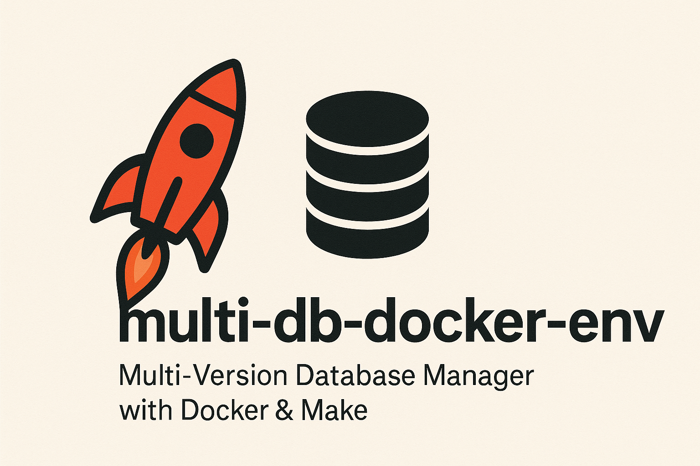

# 🚀 Multi-Version Database Manager with Docker & Make (multi-db-docker-env)

[](https://www.buymeacoffee.com/jmrenouard)

A modular Docker-based lab for running and testing multiple versions of MySQL, PostgreSQL, MongoDB, Redis, and Cassandra.

This project provides a flexible development environment to quickly launch and manage different versions of MySQL, MariaDB, and Percona Server using Docker, Docker Compose, and a `Makefile` for streamlined operations.

A key feature is the **Traefik reverse proxy**, which ensures all database instances are accessible through a single, stable port on your host machine (`localhost:3306`), regardless of which specific database version you choose to run.

## 📋 Prerequisites

Before you begin, ensure you have the following tools installed:

* [Docker](https://docs.docker.com/get-docker/)
* [Docker Compose](https://docs.docker.com/compose/install/) (usually included with Docker Desktop)
* `make` (available on most Linux/macOS systems. For Windows, you can use Chocolatey: `choco install make`)

## ⚙️ Initial Setup

The only required configuration step is to set the root password for your databases.

1. Create a file named `.env` in the project's root directory.
2. Add the following line, replacing `your_super_secret_password` with a strong password of your choice (do not use quotes around the password):

    ```env
    # File: .env
    DB_ROOT_PASSWORD=your_super_secret_password
    ```

⚠️ **Important**: This `DB_ROOT_PASSWORD` is crucial for the `make mycnf` and `make client` commands to function correctly.

## ✨ Usage with Makefile

The `Makefile` is the main entry point for managing the environment. It simplifies all operations into short, memorable commands.

### General Commands

These commands help you manage and interact with the overall environment.

| Command         | Icon | Description                                                                 | Example Usage         |
| :-------------- | :--- | :-------------------------------------------------------------------------- | :-------------------- |
| `make help`     | 📜   | Displays the full list of all available commands.                           | `make help`           |
| `make stop`     | 🛑   | Stops and properly removes all containers and networks for this project.    | `make stop`           |
| `make status`   | 📊   | Shows the status of the project's active containers (Traefik + DB).         | `make status`         |
| `make info`     | ℹ️   | Provides information about the active DB service and recent logs.           | `make info`           |
| `make logs`     | 📄   | Displays logs for the currently active database service (or all if none).   | `make logs`           |
| `make mycnf`    | 🔑   | Generates a `~/.my.cnf` file for password-less `mysql` client connections.  | `make mycnf`          |
| `make client`   | 💻   | Starts a MySQL client connected to the active database.                     | `make client`         |

### Data Management

These commands allow you to inject sample databases into a running service or run a comprehensive test suite across all services.

| Command                            | Icon | Description                                                                                                                              | Example Usage                                    |
| :--------------------------------- | :--- | :--------------------------------------------------------------------------------------------------------------------------------------- | :----------------------------------------------- |
| `make inject-data`                 | 💉   | Injects a sample database (`employees` or `sakila`) into a specified running service.                                                      | `make inject-data service=mysql84 db=employees`  |
| `make test-all`                    | 🧪   | Runs a full test suite: starts each DB service, injects both sample databases, verifies the data, and then stops the service.             | `make test-all`                                  |

### Starting a Database Instance

To start a specific database instance, use the `make <database_version>` command. The Makefile will automatically stop any currently running database instance before launching the new one, ensuring only one database (plus Traefik) runs at a time.

**MySQL**

| Command         | Icon | Description          |
| :-------------- | :--- | :------------------- |
| `make mysql93`  | 🐬   | Starts MySQL 9.3     |
| `make mysql84`  | 🐬   | Starts MySQL 8.4     |
| `make mysql80`  | 🐬   | Starts MySQL 8.0     |
| `make mysql57`  | 🐬   | Starts MySQL 5.7     |

**MariaDB**

| Command           | Icon | Description            |
| :---------------- | :--- | :--------------------- |
| `make mariadb114` | 🐧   | Starts MariaDB 11.4    |
| `make mariadb1011`| 🐧   | Starts MariaDB 10.11   |
| `make mariadb106` | 🐧   | Starts MariaDB 10.6    |

| `make percona80` | ⚡   | Starts Percona Server 8.0 |

**MariaDB Clusters (Galera & Replication)**

Advanced MariaDB architectures with synchronous clustering or master/slave replication.

| Command            | Icon | Description                                   |
| :----------------- | :--- | :-------------------------------------------- |
| `make up-galera`   | 🌐   | Starts MariaDB Galera Cluster (3 nodes)       |
| `make up-repli`    | 🔄   | Starts MariaDB Replication Cluster (3 nodes)  |
| `make test-galera` | 🧪   | Runs functional tests on Galera               |
| `make test-repli`  | 🧪   | Runs functional tests on Replication          |

> [!NOTE]
> MariaDB clusters use a custom `mariadb_ssh` image and have dedicated ports (e.g., 3511-3513 for Galera, 3411-3413 for Replication).

**Example: Switching Databases**

```bash
# 1. You are working with MySQL 8.0
make mysql80

# 2. You want to switch to Percona 8.4. No need to stop manually.
make percona84
# This will stop mysql80 and then start percona84.
```

## 🏛️ Architecture

The system uses a **Traefik reverse proxy** as a smart router. It is the only service exposed on your host machine's port `3306` and automatically forwards traffic to the currently active database instance.

```mermaid
graph TD
    subgraph "💻 Your Host Machine"
        App[Your App / SQL Client]
    end

    subgraph "🐳 Docker Engine"
        direction LR
        subgraph "🚪 Single Entrypoint"
            Traefik[traefik-db-proxy<br/>proxy-for-db<br/>Listens on localhost:3306]
        end
        subgraph "🚀 On-Demand Database Container"
            ActiveDB["Active Database Instance<br/>e.g., mysql80, percona84<br/>Internal Docker Port"]
        end
    end

    App -- "Connects to localhost:3306" --> Traefik
    Traefik -- "Dynamically routes traffic to" --> ActiveDB
```



✨ **Traefik Dashboard**: To see this routing in action and inspect Traefik's configuration, open your browser and navigate to [http://localhost:8080](http://localhost:8080).

## 📁 Project Structure

```
.
├── 📜 .env                 # Secrets file (password), to be created by you
├── 🐳 docker-compose.yml  # Defines single-instance services (Traefik, DBs)
├── 🐳 docker-compose-galera.yml # MariaDB Galera Cluster definition
├── 🐳 docker-compose-repli.yml  # MariaDB Replication Cluster definition
├── 🛠️ Makefile             # Unified management of single DBs and clusters
├── 📂 documentation/      # Detailed guides for clusters and scripts
├── 📂 reports/            # Performance and test reports
├── 📚 [INDEX.md](documentation/INDEX.md) # Documentation Index
├── 📖 README.md           # This file (English documentation)
└── 📖 README.fr.md        # French version of this file
```

## 📚 Documentation

For detailed information on specific components, please refer to the following guides:

* **[Documentation Index](documentation/INDEX.md)**: Main entry point for all documentation.
* **[Architecture](documentation/architecture.md)**: Network layout and topology.
* **[Makefile Reference](documentation/makefile.md)**: Comprehensive list of all available commands.
* **[Utility Scripts](documentation/scripts.md)**: Backup, restore, and setup script details.
* **[Test Scenarios](documentation/tests.md)**: Specific test cases and reporting instructions.
* **[Galera Bootstrap](documentation/galera_bootstrap.md)**: Detailed steps for Galera clustering.
* **[Replication Setup](documentation/replication_setup.md)**: Master/Slave configuration guide.

## 💡 Typical Workflow

Here is a diagram illustrating a common workflow:


1. **Choose and start a database version**:

    ```bash
    make mysql84
    ```

2. **(Optional but Recommended)** Generate your `~/.my.cnf` for easy client access:

    ```bash
    make mycnf
    ```

3. **Connect using your preferred SQL client** to `localhost:3306` or use the provided Make command:

    ```bash
    make client
    ```

4. **Develop and test** against the database.
5. **Check logs** if needed:

    ```bash
    make logs
    ```

6. **Switch to another database version** if required:

    ```bash
    make mariadb114
    ```

7. When done, **stop the environment**:

    ```bash
    make stop
    ```
