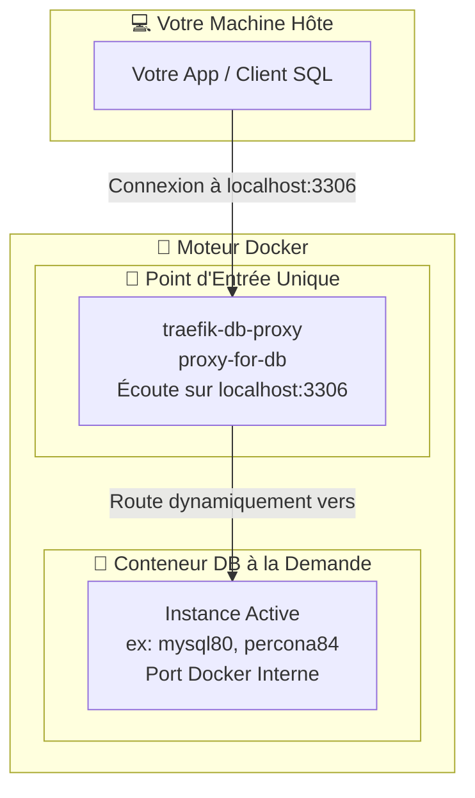
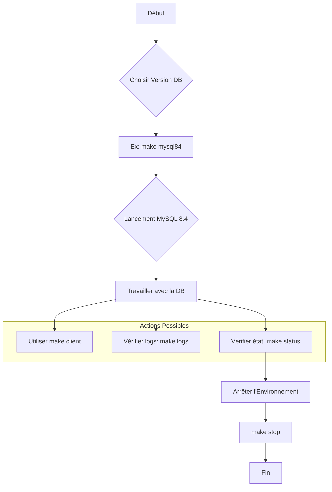

# 🚀 Gestionnaire de Bases de Données Multi-Versions avec Docker & Make (multi-db-docker-env)


[](https://www.buymeacoffee.com/jmrenouard)

Une fonctionnalité clé est le **proxy inverse Traefik**, qui garantit que toutes les instances de base de données sont accessibles via un port unique et stable sur votre machine hôte (`localhost:3306`), quelle que soit la version spécifique de la base de données que vous choisissez d'exécuter.

> [!IMPORTANT]
> **Politique d'Anglais Uniquement** : Tous les commentaires techniques dans le code, les fichiers de configuration et la documentation de ce projet DOIVENT être en anglais UNIQUEMENT.

## 📋 Prérequis

Avant de commencer, assurez-vous d'avoir installé les outils suivants :

* [Docker](https://docs.docker.com/get-docker/)
* [Docker Compose](https://docs.docker.com/compose/install/) (généralement inclus avec Docker Desktop)
* `make` (disponible sur la plupart des systèmes Linux/macOS. Pour Windows, vous pouvez utiliser Chocolatey : `choco install make`)

## ⚙️ Configuration Initiale

La seule étape de configuration requise est de définir le mot de passe root pour vos bases de données.

1. Créez un fichier nommé `.env` dans le répertoire racine du projet.
2. Ajoutez la ligne suivante, en remplaçant `your_super_secret_password` par un mot de passe fort de votre choix (ne mettez pas de guillemets autour du mot de passe) :

    ```env
    # Fichier : .env
    DB_ROOT_PASSWORD=your_super_secret_password
    ```

⚠️ **Important** : Ce `DB_ROOT_PASSWORD` est crucial pour le bon fonctionnement des commandes `make mycnf` et `make client`.

## ✨ Utilisation avec Makefile

Le `Makefile` est le point d'entrée principal pour la gestion de l'environnement. Il simplifie toutes les opérations en commandes courtes et mémorisables.

### Commandes Générales

Ces commandes vous aident à gérer et à interagir avec l'ensemble de l'environnement.

| Command         | Icon | Description                                                                 | Exemple d'utilisation |
| :-------------- | :--- | :-------------------------------------------------------------------------- | :-------------------- |
| `make help`     | 📜   | Affiche la liste complète de toutes les commandes disponibles.              | `make help`           |
| `make start`    | 🚀   | Démarre le service de base de données par défaut (MariaDB 11.8).           | `make start`          |
| `make stop`     | 🛑   | Arrête et supprime correctement tous les conteneurs et réseaux du projet.   | `make stop`           |
| `make status`   | 📊   | Affiche l'état des conteneurs actifs du projet (Traefik + DB).              | `make status`         |
| `make info`     | ℹ️   | Fournit des informations sur le service DB actif et les logs récents.       | `make info`           |
| `make logs`     | 📄   | Affiche les logs du service de base de données actuellement actif.          | `make logs`           |
| `make mycnf`    | 🔑   | Génère un fichier `~/.my.cnf` pour des connexions client sans mot de passe. | `make mycnf`          |
| `make client`   | 💻   | Démarre un client MySQL connecté à la base de données active.               | `make client`         |
| `make verify`   | ✅   | Exécute une validation complète de l'environnement (test-config).           | `make verify`         |
| `python3 interactive_runner.py` | 🚀 | Lance le coureur de tests interactif pour une configuration guidée. | `python3 interactive_runner.py` |

### Gestion des Données

Ces commandes permettent d'injecter des exemples de bases de données ou d'exécuter une suite de tests complète.

| Command                            | Icon | Description                                                                                                                              | Exemple d'utilisation                             |
| :--------------------------------- | :--- | :--------------------------------------------------------------------------------------------------------------------------------------- | :----------------------------------------------- |
| `make inject`                      | 💉   | Alias pour `inject-employees` sur l'environnement actif. Détecte Galera ou Réplication.                                                   | `make inject`                                    |
| `make inject-employees`            | 💉   | Injecte la base `employees` avec auto-détection de l'environnement.                                                                     | `make inject-employees`                          |
| `make inject-sakila`               | 💉   | Injecte la base `sakila` avec auto-détection de l'environnement.                                                                        | `make inject-sakila`                             |
| `make inject-data`                 | 💉   | Injecte une base (`employees` ou `sakila`) dans un service spécifique en cours d'exécution.                                              | `make inject-data service=mysql84 db=employees`  |
| `make sync-test-db`               | 🔄   | Synchronise le sous-module `test_db` avec la branche master distante.                                                                    | `make sync-test-db`                             |
| `make test-all`                    | 🧪   | Exécute une suite de tests complète : démarre chaque service, injecte les bases, vérifie les données, puis s'arrête.                     | `make test-all`                                  |

### Démarrage d'une Instance de Base de Données

Pour démarrer une version spécifique, utilisez `make <version_db>`. Le Makefile arrêtera automatiquement toute instance en cours avant de lancer la nouvelle.

**MySQL**

| Command         | Icon | Description          |
| :-------------- | :--- | :------------------- |
| `make mysql93`  | 🐬   | Démarre MySQL 9.3    |
| `make mysql84`  | 🐬   | Démarre MySQL 8.4    |
| `make mysql80`  | 🐬   | Démarre MySQL 8.0    |

**MariaDB**

| Command           | Icon | Description            |
| :---------------- | :--- | :--------------------- |
| `make mariadb114` | 🐧   | Démarre MariaDB 11.4   |
| `make mariadb1011`| 🐧   | Démarre MariaDB 10.11  |
| `make mariadb106` | 🐧   | Démarre MariaDB 10.6   |

**Percona Server**

| Command           | Icon | Description            |
| :---------------- | :--- | :--------------------- |
| `make percona84` | ⚡   | Démarre Percona 8.4    |
| `make percona80` | ⚡   | Démarre Percona 8.0    |

## 🏗️ Environnement Technique

### 🌐 Réseautage

Le projet utilise des sous-réseaux privés standardisés pour l'isolation des clusters :

* **Cluster Galera** : `10.6.0.0/24`
* **Cluster de Réplication** : `10.5.0.0/24`

Ces plages sont cohérentes entre les configurations `docker-compose` et les scripts d'orchestration internes.

### 🔐 Identifiants

Les identifiants par défaut sont centralisés dans le fichier `.env` via `DB_ROOT_PASSWORD`.

* **Utilisateur par défaut** : `root`
* **Base de données par défaut** : `employees` (après injection)

**Clusters MariaDB (Galera & Réplication)**

Architectures MariaDB avancées avec clustering synchrone ou réplication maître/esclave.

| Command            | Icon | Description                                   |
| :----------------- | :--- | :-------------------------------------------- |
| `make up-galera`   | 🌐   | Démarre le cluster Galera (3 nœuds)           |
| `make up-repli`    | 🔄   | Démarre le cluster de Réplication (3 nœuds)   |
| `make test-galera` | 🧪   | Exécute les tests fonctionnels sur Galera     |
| `make test-repli`  | 🧪   | Exécute les tests fonctionnels sur Réplication|

> [!NOTE]
> Les clusters MariaDB utilisent une image personnalisée `mariadb_ssh` et ont des ports dédiés (ex: 3511-3513 pour Galera).

**Exemple : Changer de Base de Données**

```bash
# 1. Vous travaillez avec MySQL 8.0
make mysql80

# 2. Vous voulez passer à Percona 8.4. Pas besoin d'arrêter manuellement.
make percona84
# Cela arrêtera mysql80 puis démarrera percona84.

# 3. Vérifier l'environnement
make verify
```

## 🏛️ Architecture

Le système utilise un **proxy inverse Traefik** comme routeur intelligent. C'est le seul service exposé sur le port `3306` de votre hôte et il redirige automatiquement le trafic vers l'instance de base de données active.



✨ **Tableau de Bord Traefik** : Pour voir ce routage en action, ouvrez votre navigateur sur [http://localhost:8080](http://localhost:8080).

## 📁 Structure du Projet

```
.
├── 📜 .env                 # Fichier des secrets (mot de passe), à créer par vous
├── 🐳 docker-compose.yml  # Définit les services mono-instance (Traefik, DBs)
├── 🐳 docker-compose-galera.yml # Définition du Cluster MariaDB Galera
├── 🐳 docker-compose-repli.yml  # Définition du Cluster MariaDB Réplication
├── 🛠️ Makefile             # Gestion unifiée des instances et clusters
├── 📂 documentation/      # Guides détaillés pour les clusters et scripts
├── 📂 reports/            # Rapports de performance et de tests
├── 📚 [INDEX.md](documentation/INDEX.md) # Index de la documentation
├── 📖 README.md           # Ce fichier (Documentation en anglais)
└── 📖 README_fr.md        # Version française de ce fichier
```

## 📚 Documentation

Pour des informations détaillées, veuillez vous référer aux guides suivants :

* **[Index de la Documentation](documentation/INDEX.md)** : Point d'entrée principal.
* **[Architecture](documentation/architecture.md)** : Schéma réseau et topologie.
* **[Référence Makefile](documentation/makefile.md)** : Liste exhaustive des commandes.
* **[Scripts Utilitaires](documentation/scripts.md)** : Détails sur les scripts de backup, restauration et setup.
* **[Scénarios de Test](documentation/tests.md)** : Cas de test spécifiques et rapports.
* **[Bootstrap Galera](documentation/galera_bootstrap.md)** : Étapes détaillées pour Galera.
* **[Setup Réplication](documentation/replication_setup.md)** : Guide de configuration Maître/Esclave.

## 💡 Flux de Travail Typique



1. **Choisissez et démarrez une version** :

    ```bash
    make mysql84
    ```

2. **(Optionnel mais recommandé)** Générez votre `~/.my.cnf` :

    ```bash
    make mycnf
    ```

3. **Connectez-vous** via `localhost:3306` ou via la commande Make :

    ```bash
    make client
    ```

4. **Développez et testez** contre la base de données.
5. **Vérifiez les logs** si nécessaire :

    ```bash
    make logs
    ```

6. **Changez de version** si besoin :

    ```bash
    make mariadb114
    ```

7. Une fois terminé, **arrêtez tout** :

    ```bash
    make stop
    ```
