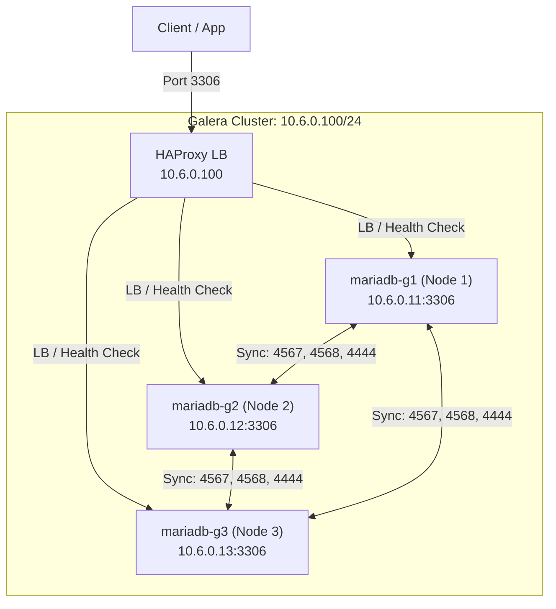
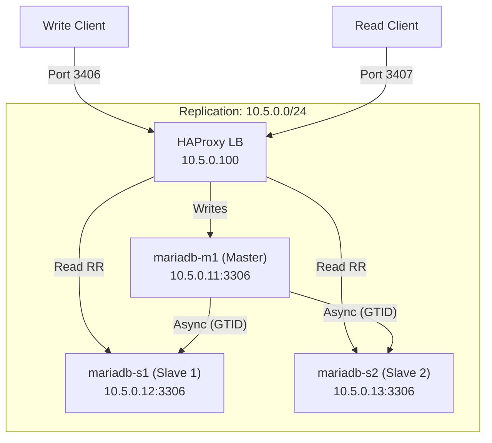

# Global Architecture 🏗️

This document describes the network and server topology of the MariaDB Docker environment.

## 🌐 1. Galera Cluster Architecture

The Galera cluster provides synchronous multi-master replication.

### Network Topology

- **Subnet**: `10.6.0.0/24`
- **Load Balancer (LB)**: `10.6.0.100` (HAProxy)

### Diagram

### Access Details

| Logical Name | Node | Role | IP Address | MariaDB Port | SSH Port |
| :--- | :--- | :--- | :--- | :--- | :--- |
| `mariadb-g1` | Node 1 | Multi-Master | `10.6.0.11` | 3511 | 22001 |
| `mariadb-g2` | Node 2 | Multi-Master | `10.6.0.12` | 3512 | 24002 |
| `mariadb-g3` | Node 3 | Multi-Master | `10.6.0.13` | 3513 | 24003 |
| `haproxy_galera`| LB | Load Balancer | `10.6.0.100` | 3306 | N/A |

---

## 🔄 2. Replication Cluster Architecture

The replication cluster uses a classic Master/Slave topology with GTID.

### Network Topology

- **Subnet**: `10.5.0.0/24`
- **Load Balancer (LB)**: `10.5.0.100` (HAProxy)

### Diagram

### Access Details

| Logical Name | Node | Role | IP Address | MariaDB Port | SSH Port |
| :--- | :--- | :--- | :--- | :--- | :--- |
| `mariadb-m1` | Node 1 | Master | `10.5.0.11` | 3411 | 23001 |
| `mariadb-s1` | Node 2 | Slave 1 | `10.5.0.12` | 3412 | 23002 |
| `mariadb-s2` | Node 3 | Slave 2 | `10.5.0.13` | 3413 | 23003 |
| `haproxy_repli` | LB | Write -> M1 | `10.5.0.100` | 3406 | N/A |
| `haproxy_repli` | LB | Read -> S1/S2 | `10.5.0.100` | 3407 | N/A |

---

## 📊 3. Monitoring & Observability

Both clusters are pre-configured for audit and performance analysis.

### Performance Schema (PFS)

Enabled by default on all nodes. It provides high-granularity data on:

- **Statement execution**: Detailed query statistics and history.
- **Wait events**: Analysis of resource contention (locks, IO).
- **Transactions**: Tracking of current and historical transactions.

### Slow Query Logging

Configured with an aggressive sampling to minimize overhead while capturing outliers.

- **Threshold**: 2.0 seconds (`long_query_time`).
- **Sampling**: 1 out of every 5 queries (`log_slow_rate_limit`).
- **Storage**: Logs are stored in `/var/lib/mysql/*.slow` and accessible via `make logs-slow-*`.
