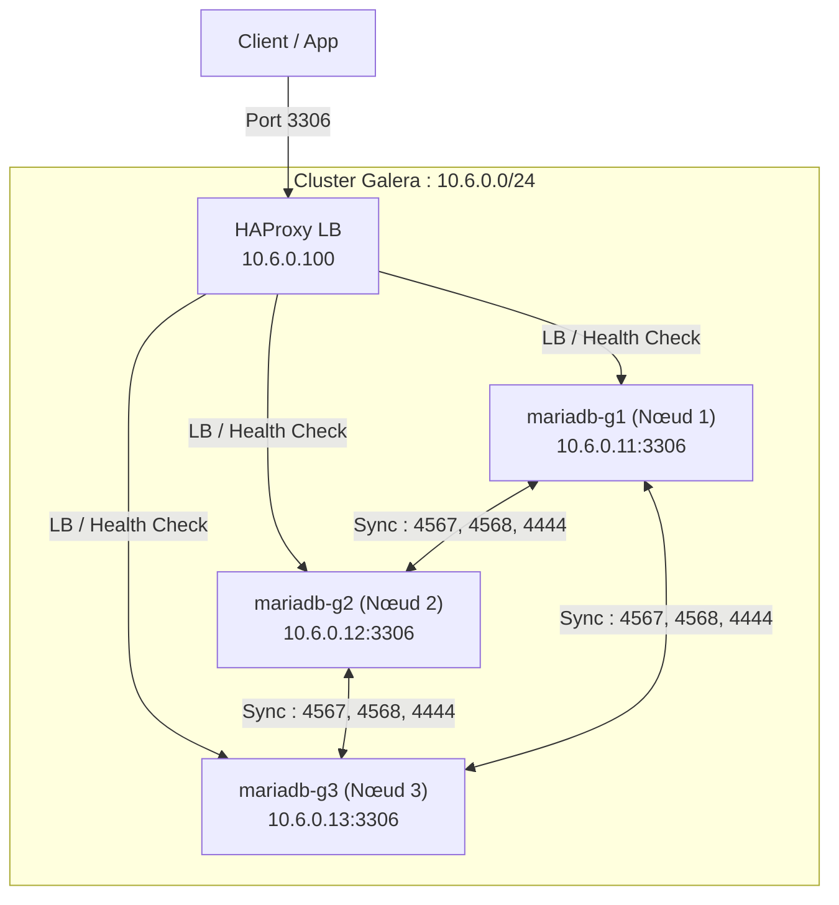
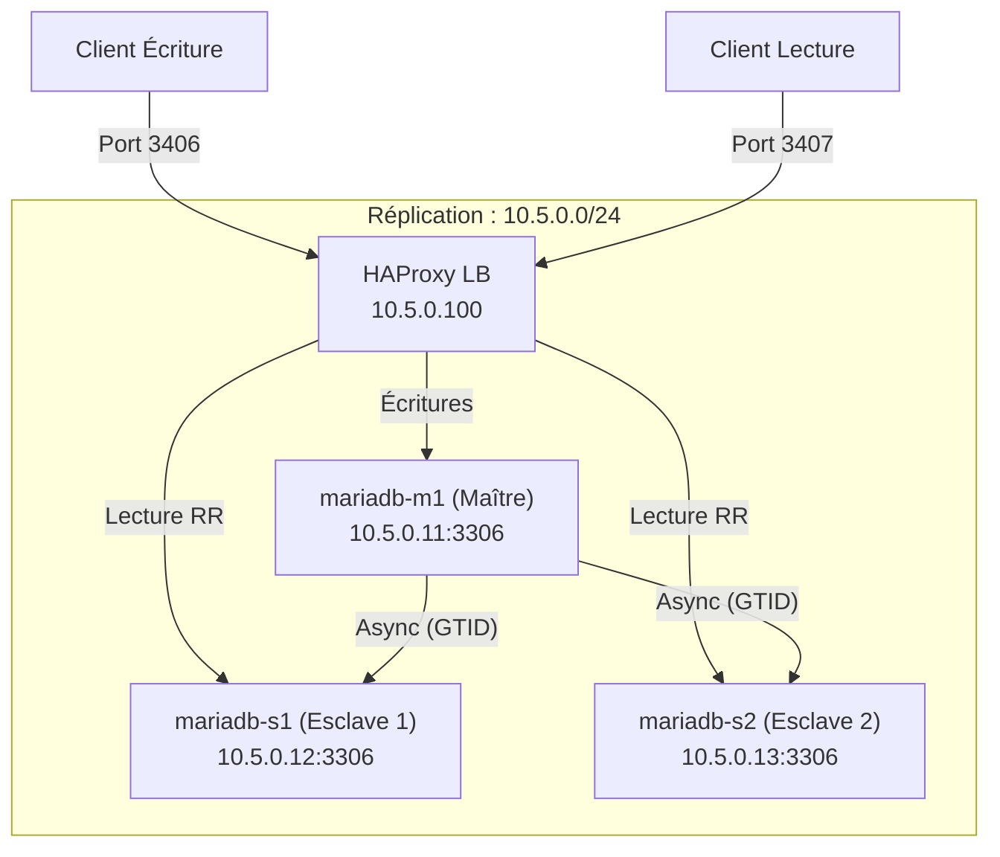

# Architecture Globale 🏗️

Ce document décrit la topologie réseau et serveur de l'environnement Docker MariaDB.

## 🌐 1. Architecture du Cluster Galera

Le cluster Galera fournit une réplication multi-maître synchrone.

### Topologie Réseau

- **Sous-réseau** : `10.6.0.0/24`
- **Répartiteur de charge (LB)** : `10.6.0.100` (HAProxy)

### Schéma

### Détails des Accès

| Nom Logique | Nœud | Rôle | Adresse IP | Port MariaDB | Port SSH |
| :--- | :--- | :--- | :--- | :--- | :--- |
| `mariadb-g1` | Nœud 1 | Multi-Maître | `10.6.0.11` | 3511 | 22001 |
| `mariadb-g2` | Nœud 2 | Multi-Maître | `10.6.0.12` | 3512 | 24002 |
| `mariadb-g3` | Nœud 3 | Multi-Maître | `10.6.0.13` | 3513 | 24003 |
| `haproxy_galera`| LB | Répartiteur | `10.6.0.100` | 3306 | N/A |

---

## 🔄 2. Architecture du Cluster de Réplication

Le cluster de réplication utilise une topologie classique Maître/Esclave avec GTID.

### Topologie Réseau

- **Sous-réseau** : `10.5.0.0/24`
- **Répartiteur de charge (LB)** : `10.5.0.100` (HAProxy)

### Schéma

### Détails des Accès

| Nom Logique | Nœud | Rôle | Adresse IP | Port MariaDB | Port SSH |
| :--- | :--- | :--- | :--- | :--- | :--- |
| `mariadb-m1` | Nœud 1 | Maître | `10.5.0.11` | 3411 | 23001 |
| `mariadb-s1` | Nœud 2 | Esclave 1 | `10.5.0.12` | 3412 | 23002 |
| `mariadb-s2` | Nœud 3 | Esclave 2 | `10.5.0.13` | 3413 | 23003 |
| `haproxy_repli` | LB | Écriture -> M1 | `10.5.0.100` | 3406 | N/A |
| `haproxy_repli` | LB | Lecture -> S1/S2 | `10.5.0.100` | 3407 | N/A |

---

## 📊 3. Supervision & Observabilité

Les deux clusters sont pré-configurés pour l'audit et l'analyse de performance.

### Performance Schema (PFS)

Activé par défaut sur tous les nœuds. Il fournit des données de haute précision sur :

- **Exécution des instructions** : Statistiques détaillées et historique des requêtes.
- **Événements d'attente** : Analyse de la contention des ressources (verrous, IO).
- **Transactions** : Suivi des transactions actuelles et passées.

### Slow Query Logging

Configuré avec un échantillonnage agressif pour minimiser l'impact CPU tout en capturant les requêtes anormales.

- **Seuil** : 2.0 secondes (`long_query_time`).
- **Échantillonnage** : 1 requête sur 5 (`log_slow_rate_limit`).
- **Stockage** : Les journaux sont stockés dans `/var/lib/mysql/*.slow` et accessibles via `make logs-slow-*`.
