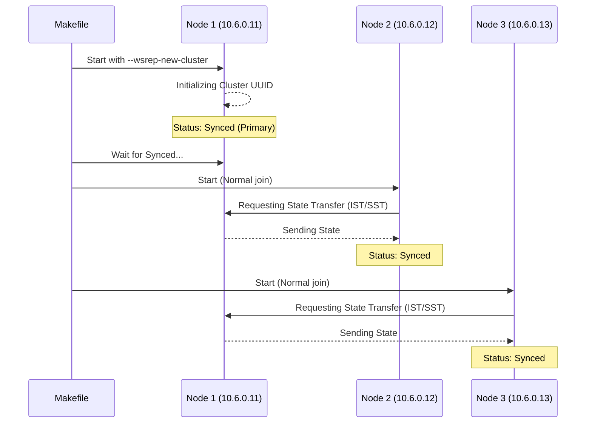

# Galera Cluster Bootstrap 🚀

Bootstrapping a Galera cluster is a specific process required to initialize a NEW cluster.

## 🛠️ The Bootstrap Process

Unlike a regular start (`make up-galera`), bootstrapping ensures that the first node initializes a new cluster UUID and state instead of trying to join an existing one.

### 1. Sequential Bootstrap with Makefile

The simplest way is to use the dedicated command:

```bash
make bootstrap-galera
```

This command performs the following steps:

1. **Node 1 Start**: Starts `galera_01` with the environment variable `MARIADB_GALERA_BOOTSTRAP=1`.
2. **Wait for Sync**: Polls Node 1 until `wsrep_local_state_comment` is `Synced`.
3. **Node 2 Join**: Starts `galera_02`.
4. **Wait for Sync**: Polls Node 2 until it joins and syncs.
5. **Node 3 Join**: Starts `galera_03`.
6. **Wait for Sync**: Polls Node 3.
7. **Load Balancer**: Starts `haproxy_galera`.

## ⚙️ Technical Details

### Environment Variable

Inside the container, the `start-mariadb.sh` script checks for `MARIADB_GALERA_BOOTSTRAP`. If set to `1`, it appends `--wsrep-new-cluster` to the MariaDB startup command.

### Configuration (`gcustom_X.cnf`)

The nodes are configured with:

- `wsrep_on=ON`
- `wsrep_provider=/usr/lib/galera/libgalera_smm.so`
- `wsrep_cluster_address=gcomm://10.6.0.11,10.6.0.12,10.6.0.13`

## 🛡️ Diagram: Bootstrap Sequence



## ⚠️ Recovery from Full Shutdown

If the entire cluster is stopped, you must identify the node with the highest `seqno` in `grastate.dat` and bootstrap from that node. In this development environment, `make bootstrap-galera` always assumes a fresh start or that Node 1 is the intended primary.
