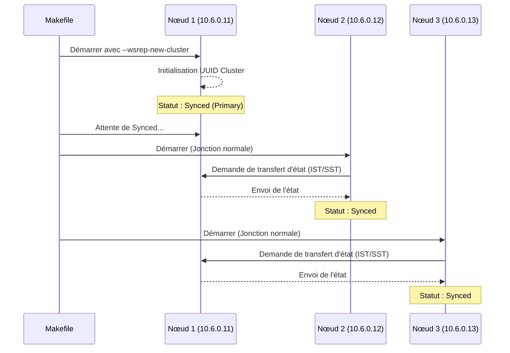

# Initialisation (Bootstrap) du Cluster Galera 🚀

L'initialisation (bootstrap) d'un cluster Galera est un processus spécifique requis pour démarrer un NOUVEAU cluster.

## 🛠️ Le Processus de Bootstrap

Contrairement à un démarrage classique (`make up-galera`), le bootstrap garantit que le premier nœud initialise un nouvel UUID et un nouvel état de cluster au lieu d'essayer d'en rejoindre un existant.

### 1. Bootstrap Séquentiel avec le Makefile

La méthode la plus simple consiste à utiliser la commande dédiée :

```bash
make bootstrap-galera
```

Cette commande effectue les étapes suivantes :

1. **Démarrage du Nœud 1** : Démarre `galera_01` avec la variable d'environnement `MARIADB_GALERA_BOOTSTRAP=1`.
2. **Attente de Synchronisation** : Interroge le Nœud 1 jusqu'à ce que `wsrep_local_state_comment` soit à `Synced`.
3. **Jonction du Nœud 2** : Démarre `galera_02`.
4. **Attente de Synchronisation** : Interroge le Nœud 2 jusqu'à ce qu'il rejoigne et se synchronise.
5. **Jonction du Nœud 3** : Démarre `galera_03`.
6. **Attente de Synchronisation** : Interroge le Nœud 3.
7. **Répartiteur de charge** : Démarre `haproxy_galera`.

## ⚙️ Détails Techniques

### Variable d'Environnement

À l'intérieur du conteneur, le script `start-mariadb.sh` vérifie la présence de `MARIADB_GALERA_BOOTSTRAP`. Si elle est définie à `1`, il ajoute `--wsrep-new-cluster` à la commande de démarrage de MariaDB.

### Configuration (`gcustom_X.cnf`)

Les nœuds sont configurés avec :

- `wsrep_on=ON`
- `wsrep_provider=/usr/lib/galera/libgalera_smm.so`
- `wsrep_cluster_address=gcomm://10.6.0.11,10.6.0.12,10.6.0.13`

## 🛡️ Schéma : Séquence de Bootstrap



## ⚠️ Récupération après un arrêt complet

Si l'ensemble du cluster est arrêté, vous devez identifier le nœud ayant le `seqno` le plus élevé dans `grastate.dat` et effectuer le bootstrap à partir de ce nœud. Dans cet environnement de développement, `make bootstrap-galera` suppose toujours un démarrage à neuf ou que le Nœud 1 est le primaire désigné.
