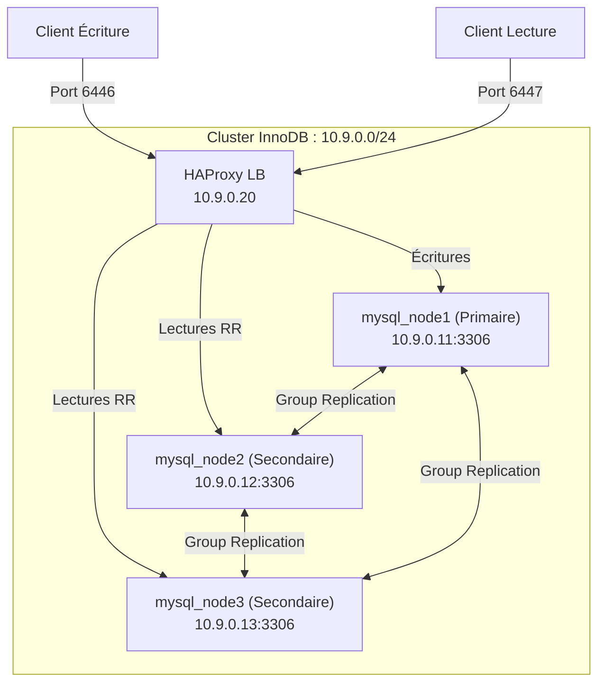

# MySQL InnoDB Cluster

Cluster MySQL 8.0 avec Group Replication et HAProxy pour le routage transparent des connexions.

## Architecture



### Composants

| Composant | Image | IP | Rôle |
| :--- | :--- | :--- | :--- |
| `mysql_node1` | `mysql:8.0` | `10.9.0.11` | Primaire (lecture/écriture) |
| `mysql_node2` | `mysql:8.0` | `10.9.0.12` | Secondaire (lecture seule) |
| `mysql_node3` | `mysql:8.0` | `10.9.0.13` | Secondaire (lecture seule) |
| `haproxy_innodb` | `haproxy:lts` | `10.9.0.20` | Routage des connexions (RW/RO) |

## Démarrage Rapide

### 1. Démarrer le Cluster

```bash
make innodb-up
```

Cette commande :
- Démarre 3 nœuds MySQL 8.0 + HAProxy
- Attend l'initialisation de tous les nœuds
- Configure Group Replication (crée l'utilisateur de réplication, amorce le primaire, joint les secondaires)
- HAProxy s'amorce automatiquement contre le cluster

### 2. Vérifier le Statut

```bash
make innodb-status
make innodb-ps
make innodb-logs
```

## Détails de Connexion

| Rôle | Port | Description |
| :--- | :--- | :--- |
| HAProxy Lecture-Écriture | `6446` | Trafic d'écriture routé vers le primaire. |
| HAProxy Lecture Seule | `6447` | Trafic de lecture réparti entre les secondaires. |
| Stats HAProxy | `8407` | Tableau de bord statistiques HAProxy. |
| MySQL Nœud 1 (Primaire) | `4411` | Accès direct au nœud primaire. |
| MySQL Nœud 2 (Secondaire) | `4412` | Accès direct au nœud secondaire 2. |
| MySQL Nœud 3 (Secondaire) | `4413` | Accès direct au nœud secondaire 3. |

### Exemple de Connexion

```bash
# Via HAProxy Lecture-Écriture (recommandé)
mysql -h 127.0.0.1 -P 6446 -uroot -p"$DB_ROOT_PASSWORD"

# Via HAProxy Lecture Seule
mysql -h 127.0.0.1 -P 6447 -uroot -p"$DB_ROOT_PASSWORD"

# Directement au nœud primaire
mysql -h 127.0.0.1 -P 4411 -uroot -p"$DB_ROOT_PASSWORD"
```

## Configuration Group Replication

| Paramètre | Valeur |
| :--- | :--- |
| `gtid-mode` | ON |
| `enforce-gtid-consistency` | ON |
| `binlog-format` | ROW |
| `group-replication-group-seeds` | `mysql_node1:33061,mysql_node2:33061,mysql_node3:33061` |
| `transaction-write-set-extraction` | XXHASH64 |

## Tests Automatisés

```bash
make test-innodb
```

La suite de tests valide **15 vérifications réparties en 10 groupes** :

| # | Test | Description |
| :--- | :--- | :--- |
| 1 | Statut des Nœuds | 3 nœuds MySQL UP avec info version |
| 2 | Group Replication | 3 membres ONLINE |
| 3 | HAProxy | Connectivité RW (6446) et RO (6447) |
| 4 | Réplication Écriture | Écriture sur primaire, vérification sur secondaires |
| 5 | Isolation Écriture | Les secondaires rejettent les écritures |
| 6 | Réplication DDL | ALTER TABLE répliqué |
| 7 | Cohérence Version | Même version MySQL sur tous les nœuds |
| 8 | Écritures Concurrentes | 30 lignes via HAProxy |
| 9 | Routage HAProxy | Le port RW route vers le primaire |
| 10 | Cohérence GTID | GTID actif sur le cluster |

Rapports générés dans `./reports/` (Markdown + HTML).

## Nettoyage

```bash
make innodb-down
```

Supprime tous les conteneurs, réseaux et volumes pour un redémarrage propre.
