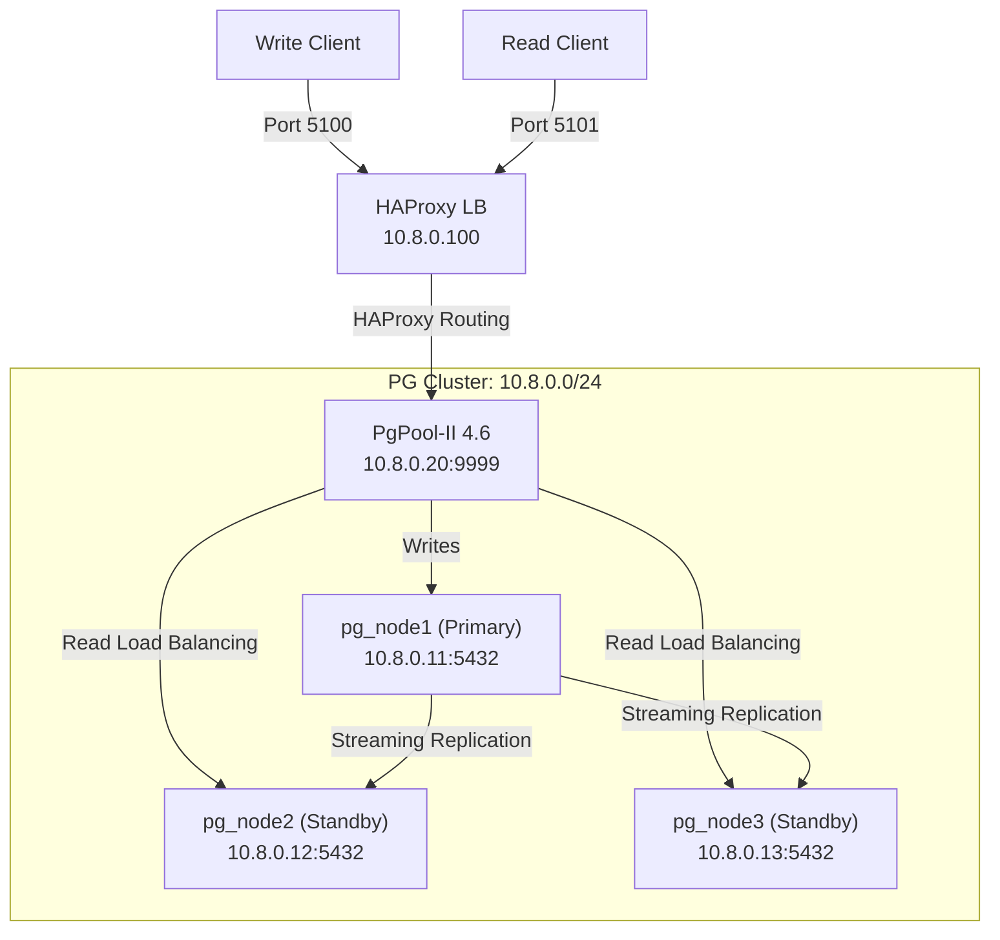

# PgPool-II PostgreSQL Cluster

High-availability PostgreSQL 17 cluster using PgPool-II for connection pooling and load balancing, with HAProxy for external access.

## Architecture



### Components

| Component | Image | IP | Role |
| :--- | :--- | :--- | :--- |
| `pg_node1` | `postgres:17` | `10.8.0.11` | Primary (read/write) |
| `pg_node2` | `postgres:17` | `10.8.0.12` | Standby (read-only) |
| `pg_node3` | `postgres:17` | `10.8.0.13` | Standby (read-only) |
| `pgpool` | `pgpool/pgpool:4.6` | `10.8.0.20` | Connection pooling + LB |
| `haproxy_pgpool` | `haproxy:latest` | `10.8.0.100` | External routing |

## Quick Start

### 1. Start the Cluster

```bash
make pgpool-up
```

This command:
- Starts 3 PostgreSQL 17 nodes + PgPool-II + HAProxy
- Automatically configures streaming replication (base backup + replication slots)
- Waits for PgPool-II to detect all backends

### 2. Check Status

```bash
make pgpool-status
make pgpool-ps
make pgpool-logs
```

## Connection Details

| Role | Port | Description |
| :--- | :--- | :--- |
| PgPool-II Direct | `9999` | Direct PgPool-II access (connection pooling + LB). |
| HAProxy Read-Write | `5100` | Write traffic routed via PgPool-II to primary. |
| HAProxy Read-Only | `5101` | Read traffic load-balanced via PgPool-II. |
| HAProxy Stats | `8406` | HAProxy statistics dashboard. |
| PostgreSQL Primary | `5611` | Direct access to primary node. |
| PostgreSQL Standby 1 | `5612` | Direct access to standby node 2. |
| PostgreSQL Standby 2 | `5613` | Direct access to standby node 3. |

### Example Connection

```bash
# Via PgPool-II (recommended)
psql -h 127.0.0.1 -p 9999 -U postgres

# Via HAProxy Read-Write
psql -h 127.0.0.1 -p 5100 -U postgres

# Via HAProxy Read-Only
psql -h 127.0.0.1 -p 5101 -U postgres
```

## PgPool-II Configuration

| Parameter | Value |
| :--- | :--- |
| `backend_clustering_mode` | `streaming_replication` |
| `num_init_children` | 32 |
| `max_pool` | 4 |
| `connection_cache` | on |
| `load_balance_mode` | on |
| `sr_check_period` | 5s |
| `health_check_period` | 10s |

## Advanced PgPool-II Monitoring

PgPool-II provides several administrative commands to manage and monitor the cluster directly via SQL interface.

### View Pool Nodes Status

```bash
psql -h 127.0.0.1 -p 9999 -U postgres -c "SHOW pool_nodes;"
```

### Display Active Connection Pools

Check connection pooling metrics to see how many cached connections are currently in use.

```bash
psql -h 127.0.0.1 -p 9999 -U postgres -c "SHOW pool_pools;"
```

### View Client Processes

```bash
psql -h 127.0.0.1 -p 9999 -U postgres -c "SHOW pool_processes;"
```

## Automated Testing

```bash
make test-pgpool
```

The test suite validates **22 checks across 15 test groups**:

| # | Test | Description |
| :--- | :--- | :--- |
| 1 | Node Status | All 3 PostgreSQL nodes are UP |
| 2 | PgPool-II Connection | Pool nodes detection and connectivity |
| 3 | HAProxy Connectivity | RW (5100) and RO (5101) ports |
| 4 | Streaming Replication | Write data, verify on standbys |
| 5 | Write Isolation | Standbys reject writes (read-only) |
| 6 | DDL Replication | ALTER TABLE replicated to standbys |
| 7 | Load Balancing | PgPool-II load balancing active |
| 8 | Version Consistency | All nodes running same PG version |
| 9 | WAL Streaming | 2 active streaming connections |
| 10 | Replication Slots | 2 active replication slots |
| 11 | Concurrent Writes | 30 rows + replication verification |
| 12 | PgPool-II Version | PgPool-II process info |
| 13 | CRUD Ops Test | Perform schema operations |
| 14 | HAProxy Stats | Stats dashboard availability |
| 15 | Connection Pools | Inspect PgPool-II Connection Pooling |
| 16 | Client Processes | View PgPool-II client processes active states |

Reports are generated in `./reports/` (Markdown + HTML).

## Cleanup

```bash
make pgpool-down
```

This removes all containers, networks, and volumes for a clean restart.
