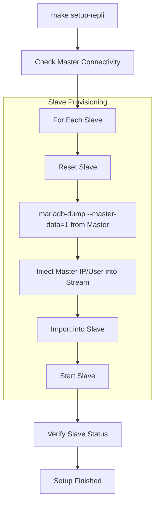

# Replication Setup Guide 🔄

This document explains how the Master/Slave replication is configured and automated.

## 🚀 Automation with `setup_repli.sh`

The `make setup-repli` command executes the `setup_repli.sh` script, which handles the entire configuration flow.

### 1. Connectivity Check

The script first verifies that the Master (Node 1 on port 3411) is reachable.

### 2. Slave Initialization (Repeat for Slave 1 and Slave 2)

For each slave, the following operations are performed:

- **Reset**: Runs `STOP SLAVE` and `RESET SLAVE ALL` to ensure a clean state.
- **Data Sync**: Uses `mariadb-dump` from the Master with `--master-data=1` and `--all-databases`.
- **Master Mapping**: Dynamically injects the Master's IP (`10.5.0.11`) and replication credentials into the dump stream using `sed`.
- **Import**: Streams the dump directly into the Slave container.
- **Start**: Runs `START SLAVE`.

## ⚙️ Advanced Features

The replication setup is configured with several modern MariaDB features (defined in `custom_X.cnf`):

- **GTID Strict Mode**: Enabled (`gtid_strict_mode=1`) to ensure consistency and easier failover.
- **Binary Log Expiration**: Set to 2 days (`binlog_expire_logs_seconds=172800`).
- **Proxy Protocol**: Configured to accept connections from HAProxy while preserving client IPs.

## 🛡️ Diagram: Setup Flow

## ✅ Manual Verification

After running the setup, you can verify the status:

1. Access a slave: `mariadb-s1` (if profiles are sourced).
2. Run: `SHOW SLAVE STATUS\G`
3. Check `Slave_IO_Running` and `Slave_SQL_Running` are both `Yes`.
