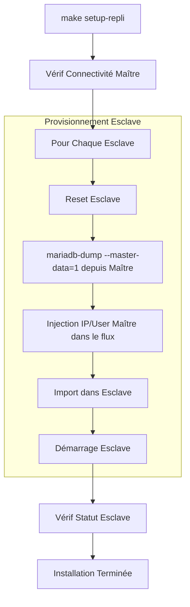

# Guide d'Installation de la Réplication 🔄

Ce document explique comment la réplication Maître/Esclave est configurée et automatisée.

## 🚀 Automatisation avec `setup_repli.sh`

La commande `make setup-repli` exécute le script `setup_repli.sh`, qui gère l'ensemble du flux de configuration.

### 1. Vérification de la Connectivité

Le script vérifie d'abord que le Maître (Nœud 1 sur le port 3411) est joignable.

### 2. Initialisation des Esclaves (Répétée pour l'Esclave 1 et l'Esclave 2)

Pour chaque esclave, les opérations suivantes sont effectuées :

- **Réinitialisation** : Exécute `STOP SLAVE` et `RESET SLAVE ALL` pour garantir un état propre.
- **Sync des Données** : Utilise `mariadb-dump` depuis le Maître avec `--master-data=1` et `--all-databases`.
- **Mappage Maître** : Injecte dynamiquement l'IP du Maître (`10.5.0.11`) et les identifiants de réplication dans le flux du dump via `sed`.
- **Import** : Transmet le dump directement dans le conteneur Esclave.
- **Démarrage** : Exécute `START SLAVE`.

## ⚙️ Fonctionnalités Avancées

La configuration de la réplication utilise plusieurs fonctionnalités modernes de MariaDB (définies dans `custom_X.cnf`) :

- **Mode GTID Strict** : Activé (`gtid_strict_mode=1`) pour garantir la cohérence et faciliter le basculement (failover).
- **Expiration des Logs Binaires** : Définie à 2 jours (`binlog_expire_logs_seconds=172800`).
- **Protocole Proxy** : Configuré pour accepter les connexions depuis HAProxy tout en préservant les IP clientes.

## 🛡️ Schéma : Flux d'Installation

## ✅ Vérification Manuelle

Après avoir exécuté l'installation, vous pouvez vérifier le statut :

1. Accédez à un esclave : `mariadb-s1` (si les profils sont chargés).
2. Exécutez : `SHOW SLAVE STATUS\G`
3. Vérifiez que `Slave_IO_Running` et `Slave_SQL_Running` sont tous deux à `Yes`.
