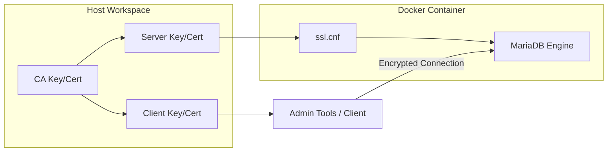

# Replication & SSL Configuration 🔐

This document provides details on how SSL is integrated into the MariaDB clusters and how to verify its operation.

## 🔑 Certificate Generation

The environment uses self-signed certificates for testing purposes.

1. **Script**: `make gen-ssl` (runs `gen_ssl.sh`)
2. **Process**:
   - Creates a Certificate Authority (CA).
   - Sign a Server certificate with the CA.
   - Sign a Client certificate with the CA.
3. **Files Created** (`ssl/` directory):
   - `ca-cert.pem`, `ca-key.pem`
   - `server-cert.pem`, `server-key.pem`
   - `client-cert.pem`, `client-key.pem`

## ⚙️ MariaDB SSL Configuration

All nodes use `ssl.cnf` to point to these certificates:

```ini
[mariadb]
ssl-ca=/etc/mysql/ssl/ca-cert.pem
ssl-cert=/etc/mysql/ssl/server-cert.pem
ssl-key=/etc/mysql/ssl/server-key.pem
```

> [!IMPORTANT]
> The `ssl/` directory is mounted as a volume in all containers at `/etc/mysql/ssl` with read-only permissions.

## 🔄 SSL in Replication

When setting up replication via `setup_repli.sh`, the process ensures that the data sync and the subsequent replication stream can be encrypted.

### Verification of SSL Status

You can verify if a connection is encrypted by checking the `Ssl_cipher` status variable:

```sql
SHOW STATUS LIKE 'Ssl_cipher';
```

In the test suites (`test_repli.sh` and `test_galera.sh`), the script automatically reports the SSL cipher used by each node.

### Forcing SSL

To force SSL for all network connections (except local), the `require_secure_transport` variable can be enabled in `ssl.cnf`.

## 🛡️ Diagram: SSL Architecture


