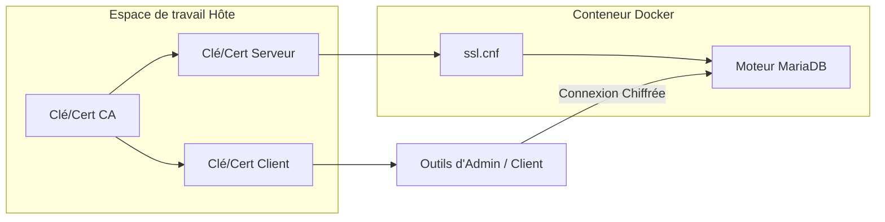

# Configuration de la Réplication & SSL 🔐

Ce document fournit des détails sur la manière dont SSL est intégré dans les clusters MariaDB et sur la façon de vérifier son fonctionnement.

## 🔑 Génération de Certificats

L'environnement utilise des certificats auto-signés à des fins de test.

1. **Script** : `make gen-ssl` (exécute `gen_ssl.sh`)
2. **Processus** :
   - Crée une Autorité de Certification (CA).
   - Signe un certificat Serveur avec la CA.
   - Signe un certificat Client avec la CA.
3. **Fichiers Créés** (répertoire `ssl/`) :
   - `ca-cert.pem`, `ca-key.pem`
   - `server-cert.pem`, `server-key.pem`
   - `client-cert.pem`, `client-key.pem`

## ⚙️ Configuration SSL de MariaDB

Tous les nœuds utilisent `ssl.cnf` pour pointer vers ces certificats :

```ini
[mariadb]
ssl-ca=/etc/mysql/ssl/ca-cert.pem
ssl-cert=/etc/mysql/ssl/server-cert.pem
ssl-key=/etc/mysql/ssl/server-key.pem
```

> [!IMPORTANT]
> Le répertoire `ssl/` est monté en tant que volume dans tous les conteneurs à l'emplacement `/etc/mysql/ssl` avec des permissions en lecture seule.

## 🔄 SSL dans la Réplication

Lors de la mise en place de la réplication via `setup_repli.sh`, le processus garantit que la synchronisation des données et le flux de réplication ultérieur peuvent être chiffrés.

### Vérification du statut SSL

Vous pouvez vérifier si une connexion est chiffrée en consultant la variable de statut `Ssl_cipher` :

```sql
SHOW STATUS LIKE 'Ssl_cipher';
```

Dans les suites de tests (`test_repli.sh` et `test_galera.sh`), le script rapporte automatiquement le chiffrement SSL utilisé par chaque nœud.

### Forcer le SSL

Pour forcer le SSL pour toutes les connexions réseau (sauf locales), la variable `require_secure_transport` peut être activée dans `ssl.cnf`.

## 🛡️ Schéma : Architecture SSL


